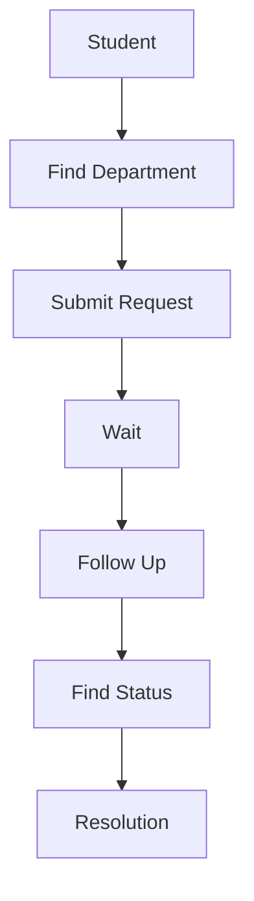
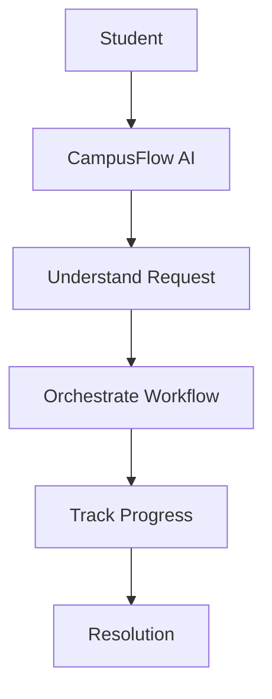

# 🚀 CampusFlow AI

## AI-Powered Student Grievance & Academic-Service Orchestration System

> **Turning campus problems into intelligent, trackable, and actionable solutions.**

CampusFlow AI is an AI-driven platform designed to streamline student grievances and academic-service requests through intelligent orchestration, structured workflows, and centralized communication.

Instead of students navigating multiple disconnected processes, CampusFlow AI brings requests into a unified system where they can be submitted, tracked, prioritized, and routed toward the appropriate resolution.

---

## 🌟 Why CampusFlow AI?

Students often face difficulties when dealing with:

- 📢 Academic grievances
- 🏫 Campus service requests
- 👨‍🏫 Faculty or department-related issues
- 📋 Tracking the status of submitted requests
- 🔄 Following up with multiple departments
- ⏳ Delays caused by disconnected workflows

### Our Vision

> **One platform. One workflow. Smarter campus services.**

---

## ✨ Key Features

- 🤖 **AI-Assisted Intelligence** — Helps understand and process student requests.
- 🎫 **Smart Grievance Management** — Submit and track grievances through structured workflows.
- 🔄 **Service Orchestration** — Organizes and routes requests toward appropriate services.
- 📊 **Centralized Dashboard** — Provides a unified view of requests, statuses, and activities.
- 👥 **Role-Based Experience** — Supports different campus stakeholders and responsibilities.
- 🔐 **Secure Configuration** — Uses environment variables for sensitive credentials.
- 🗄️ **Structured Backend** — Handles APIs, application logic, data models, and services.

---

## 🧠 How It Works

**Submit → Understand → Route → Resolve → Track**

1. Student submits a grievance or service request.
2. CampusFlow AI processes and understands the request.
3. The request is classified and organized.
4. The workflow is routed toward the relevant department or service.
5. The request is processed toward resolution.
6. The student can track the progress.

---

## 🏗️ System Architecture

```text
                 ┌────────────────────┐
                 │      Students      │
                 └─────────┬──────────┘
                           │
                           ▼
                 ┌────────────────────┐
                 │   Frontend Web App │
                 │ React + TypeScript │
                 └─────────┬──────────┘
                           │
                           ▼
                 ┌────────────────────┐
                 │    Backend API     │
                 │      FastAPI       │
                 └─────────┬──────────┘
                           │
             ┌─────────────┼─────────────┐
             ▼             ▼             ▼
        Database      AI Services    Core Services
             │             │             │
             └─────────────┼─────────────┘
                           ▼
                  Campus Service Flow

🛠️ Technology Stack

Frontend
React
TypeScript
Vite
Tailwind CSS
Backend
Python
FastAPI
SQLite
REST APIs
AI
AI/LLM Integration
Intelligent Request Processing
AI-Assisted Workflow Support
Development Tools
Git
GitHub
VS Code


Campusflow-AI/
│
├── backend/
│   ├── app/
│   │   ├── api/
│   │   ├── database/
│   │   ├── models/
│   │   ├── schemas/
│   │   ├── services/
│   │   ├── config.py
│   │   └── main.py
│   │
│   ├── requirements.txt
│   └── seed.py
│
├── frontend/
│   ├── public/
│   ├── src/
│   ├── package.json
│   ├── package-lock.json
│   └── vite.config.ts
│
├── .gitignore
└── README.md

### 🚀 CampusFlow AI Approach
```text
Student ➔ CampusFlow AI ➔ Understand Request ➔ Orchestrate Workflow ➔ Track Progress ➔ Resolution
```
# 💡 What Makes CampusFlow AI Different?

**CampusFlow AI is not designed simply as a chatbot.**  
The goal is to use AI as part of an end-to-end workflow.

## 🔄 Workflow Comparison

### ❌ Traditional Approach


### 🚀 CampusFlow AI Approach

# 🤝 Team Philosophy

> **Ideas + Technology + Collaboration + Execution**

We believe meaningful technology is built when people combine different perspectives, skills, and ideas to solve real-world problems.

---

# 🔮 Future Scope

*   **🎙️ Voice-based grievance submission**
*   **🌐 Multilingual student support**
*   **📱 Dedicated mobile application**
*   **📈 Advanced administrative analytics**
*   **🔔 Intelligent notifications**
*   **🧠 Advanced AI-based classification**
*   **🔗 Integration with existing campus systems**
*   **📊 Predictive analysis of recurring campus issues**

---

# 🔐 Security

This repository is intended for development and demonstration purposes.

> ⚠️ **Critical Rule:** Never commit the following sensitive files or credentials to version control:
*   `.env` files
*   API Keys
*   Secret Keys
*   Passwords
*   Private Credentials

*Note: Always use `.env.example` as your configuration template.*

---

# 🌱 Our Vision

CampusFlow AI is more than a software prototype. 

Our goal is to explore how AI can become a practical layer between students and the complex systems they interact with every day.

*   **Build smarter campuses.**
*   **Simplify student experiences.**
*   **Turn problems into actionable workflows.**

---

# ⭐ Support the Project

If you find CampusFlow AI interesting, consider supporting us by taking these actions:

*   **⭐ Star** the repository
*   **🍴 Fork** the project
*   **💡 Share** new ideas
*   **🐛 Report** outstanding issues
*   **🤝 Contribute** high-impact improvements

---

# 👨‍💻 Lead Custodians

### 👤 Rahul Teja
*   **Role:** Team Lead & Developer
*   **Focus:** AI/ML • Full-Stack Development • Team Leadership

### 👤 Sudeeksha
*   **Role:** Lead Custodian
*   **Focus:** Project Development • Collaboration

### 👤 Prachetha
*   **Role:** Lead Custodian
*   **Focus:** Project Development • Collaboration

### 👤 Srujan
*   **Role:** Lead Custodian
*   **Focus:** Project Development • Collaboration

---

# 📜 License

This project is currently intended for educational, experimental, and demonstration purposes.

